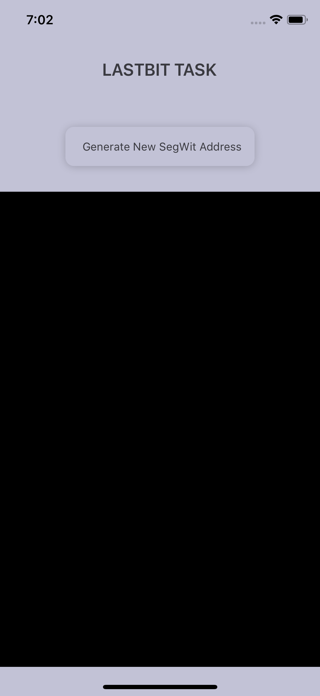
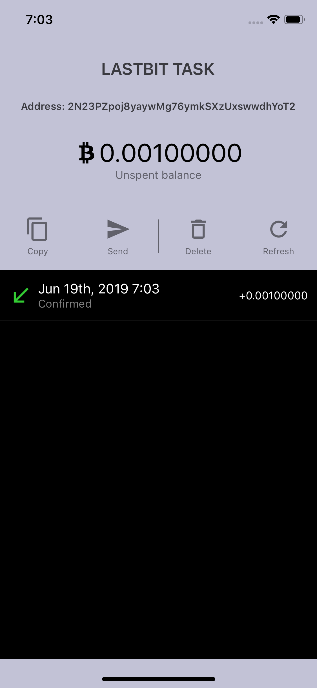
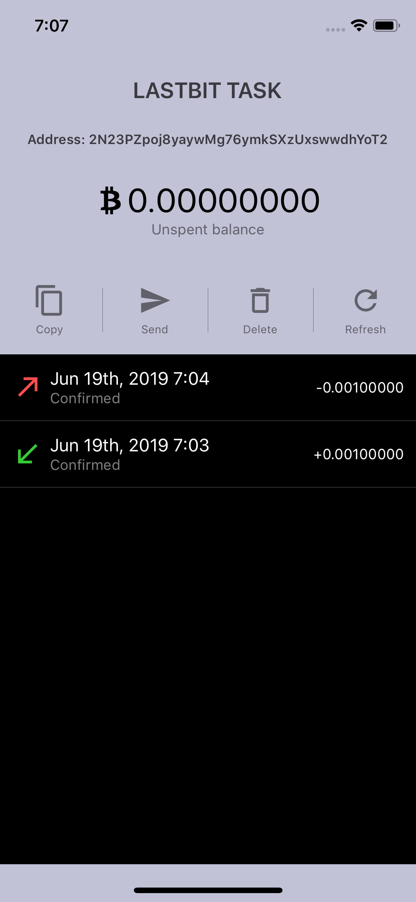

## Segwit Testnet bitcoin

This app will create a new segwit testnet bitcoin address and send the unspent transaction to another segwit address.

## Getting Started

### Installation

Please DO NOT use `npm install`.

```
yarn install
```

## Library

- [rn-bitcoinjs-lib](https://github.com/coreyphillips/rn-bitcoinjs-lib) (To generate a P2SH Segwit keypair)

## API

I have used `SoChain` API for fetching the transactions for the address and the available unspent bitcoin balance at that address.

To sign and broadcast a transaction to another Segwit address, I'm using [smartbit](https://www.smartbit.com.au/)

[SoChain Bitcoin(Testnet)](https://chain.so/testnet/btc)

### Screenshots

<p align="center">
  
  
  
  
</p>
